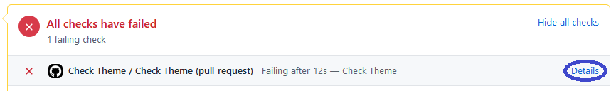

# WDD-themes

Community submitted themes for [WinDynamicDesktop](https://github.com/t1m0thyj/WinDynamicDesktop). Automatically published to the [WDD Themes site](https://windd.info/themes/).

## Submit New Themes

### Create and package your theme

Follow the instructions [here](https://github.com/t1m0thyj/WinDynamicDesktop/wiki/Creating-custom-themes) to create your own theme. Then package the images and theme.json file into a ZIP archive.

Rename the file to change the `.zip` extension to `.ddw`. The rest of the filename should equal your theme ID.

Make sure your theme meets the following requirements:

- Theme ID must be unique and can only contain alphanumeric, hyphen (`-`), and underscore (`_`) characters
- Theme package must contain theme.json file at top level
- Theme JSON must include required keys (dayImageList, imageCredits, imageFilename, nightImageList)
- Theme package cannot contain extra files in addition to images and theme.json
- Theme package must include all images referenced in theme.json
- Image size must be at least HD resolution (1920x1080)
- Image ratio must be landscape or square (16:9 is recommended)
- Image shown at noon should be brightest image in the set
- Image shown at midnight should be darkest image in the set
- Image credits must include name of the original artist/photographer

### Publish your theme to direct link

Upload your DDW file for others to download and use in WDD. Your theme must be uploaded to a direct link, meaning you must provide a URL which downloads the file directly rather than going to a web page with a download button.

You can host your theme on OneDrive or Google Drive and obtain a direct link by following instructions in the links below:

- OneDrive (recommended because it has fewer restrictions) - https://bydik.com/onedrive-direct-link/
- Google Drive (file size limit of 100MB and daily download quota) - https://bydik.com/google-drive-direct-link/

### Create pull request for your theme

Open a pull request (PR) in this repository to add your theme to the list on the [WDD Themes site](https://windd.info/themes/). Only one of the following files must be updated in your PR:

- [`themes/art.yaml`](themes/art.yaml) if the images in your theme are artwork
- [`themes/photos.yaml`](themes/photos.yaml) if the images in your theme are photographs

Find one of these files on GitHub and click the pencil icon to fork this repository and edit the file:


You only need to add two lines to the YAML file for your theme:
```yaml
<theme_id>:
- <theme_url>
```

After adding these lines, label your changes with "Add &lt;themeName&gt; theme" and click "Propose changes":


Confirm your changes and click through the green buttons labeled "Create pull request".

After your PR has been created, wait for the Check Theme task to run. It will scan your .ddw file to check that it meets all the requirements listed above. If the scan fails, click the "Details" link to find out why:



If any issues are reported, fix them and rerun the Check Theme task by posting a comment with the line `/check-theme`:


Once the Check Theme task has succeeded, your theme is ready to be published. A WDD theme reviewer will merge your pull request to add it to the [WDD Themes site](https://windd.info/themes/).
